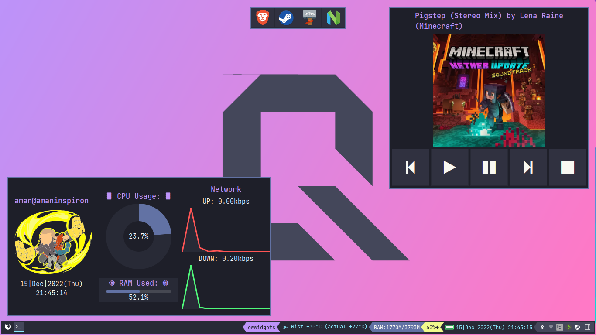

# Dotfiles (WIP)

## Disclaimer

All of these dotfiles were made for my personal use and might not work for you. It is advised to just use this repo for inspiration and reference

## Requirements:

### General

- The programs themselves  
- [JetBrains Mono](https://github.com/JetBrains/JetBrainsMono)  
- [Any Nerd Font](https://nerdfonts.com/font-downloads)  

### Neovim

- A terminal with 256-color and true color support  
 and/or
- A graphical client like [neovide](Https://github.com/neovide/neovide)

### Qtile  

- [qtile-extras](https://github.com/elParaguayo/qtile-extras)  

### EWW  

- [DeaDBeeF (music player)](github.com/DeaDBeeF-Player/deadbeef)
- [Papirus Icon Theme](https://github.com/PapirusDevelopmentTeam/papirus-icon-theme)

## Screenshot

